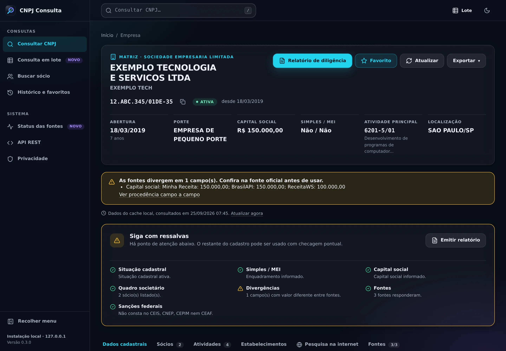
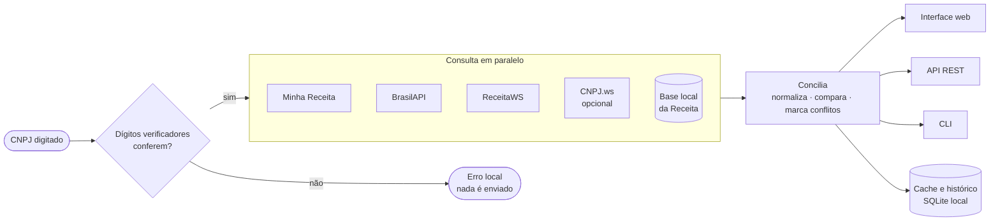
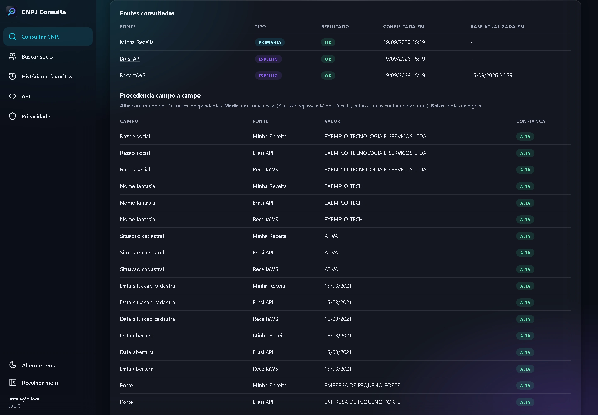
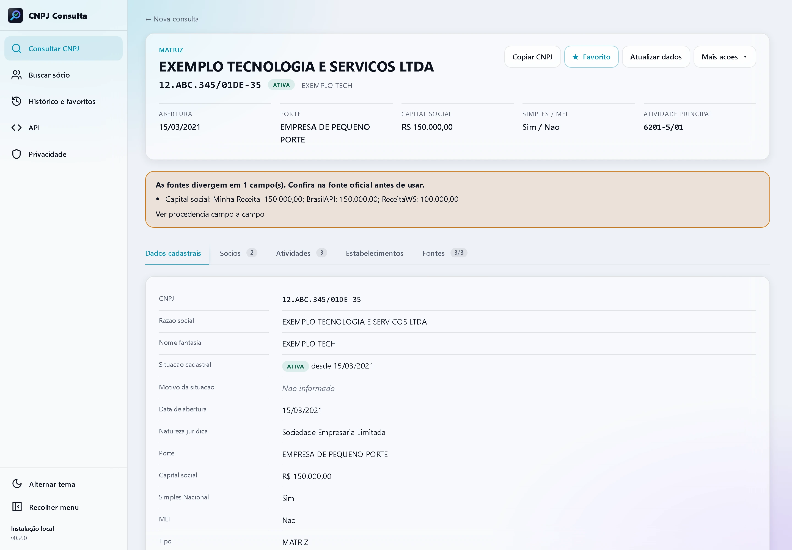

<p align="center">
  <a href="https://fredabsd-svg.github.io/cnpj-consulta/">
    <picture>
      <source media="(prefers-color-scheme: dark)" srcset="docs/assets/brand/logo-dark.svg">
      
    </picture>
  </a>
</p>

<h3 align="center">Consulta de CNPJ que mostra de onde veio cada dado.</h3>

<p align="center">
  Cruza BrasilAPI, Minha Receita, ReceitaWS e a base oficial da Receita Federal, aponta onde as fontes divergem<br>
  e mede a confiança de cada campo. Open source, sem chave de API e 100% local.
</p>

<p align="center">
  <a href="https://github.com/fredabsd-svg/cnpj-consulta/actions/workflows/ci.yml"></a>
  <a href="LICENSE"></a>
  
  
  <a href="https://fredabsd-svg.github.io/cnpj-consulta/"></a>
</p>

<p align="center">
  <a href="https://fredabsd-svg.github.io/cnpj-consulta/"><b>Site</b></a> ·
  <a href="#instalação">Instalação</a> ·
  <a href="#uso">Uso</a> ·
  <a href="#api-rest">API</a> ·
  <a href="#contribuindo">Contribuir</a>
</p>

<p align="center">
  
</p>
<p align="center"><sub>Capturas reais do app rodando localmente, com dados fictícios.</sub></p>

---

## Por que existe

Uma consulta comum devolve o que **uma** API respondeu. O CNPJ Consulta pergunta a várias fontes públicas ao mesmo tempo, compara as respostas e mostra o que está **confirmado**, o que **diverge** e **de onde veio** cada dado.

- **Procedência campo a campo** — cada valor mostra a fonte, a data da consulta e a data de atualização da base.
- **Conflitos explícitos** — quando as fontes divergem, o app avisa e mostra o valor de cada uma. Nunca escolhe em silêncio. Diferenças só de formato (acentos, código antes da descrição, `1000.00` × `1.000,00`) não contam como conflito.
- **Confiança por campo** — alta, média ou baixa (veja [como funciona](#como-funciona)).
- **CNPJ numérico e alfanumérico** — valida os dígitos verificadores dos dois formatos (o novo, com letras, vale desde julho de 2026).
- **Busca reversa por sócio e modo offline** — com a base oficial da Receita Federal importada localmente.
- **Interface web, CLI e API REST** — a interface é em português, com tema claro e escuro e sem nada carregado de CDN.
- **LGPD por padrão** — CPF de sócio sempre mascarado; histórico, cache e favoritos ficam só no seu computador.
- **Sem chave de API e sem Docker** — só Python 3.12+.

> **Aviso:** o projeto usa apenas fontes públicas e oficiais. Não inclui nem acessa bases vazadas, dados comprados ou scraping de sites protegidos. Os dados podem estar desatualizados; confira sempre a fonte exibida.

## Como funciona



1. **Valida** os dígitos verificadores (módulo 11) antes de qualquer requisição. Entrada inválida nunca sai do seu computador.
2. **Consulta em paralelo** as fontes habilitadas, com limite local por fonte, timeout de 10 s por requisição e teto de 20 s por consulta. Retentativa só para erros 5xx e de rede.
3. **Concilia**: normaliza cada campo, compara, prioriza fontes primárias sobre espelhos e marca os conflitos com o valor de cada fonte.
4. **Entrega** o resultado na interface, na CLI ou na API, e guarda no cache local (24 h por padrão).

| Confiança | Significa |
|---|---|
| **Alta** | 2 ou mais fontes **independentes** concordam |
| **Média** | uma única base (a BrasilAPI repassa a Minha Receita, então as duas contam como uma) |
| **Baixa** | as fontes divergem |

<table>
  <tr>
    <td width="50%"></td>
    <td width="50%"></td>
  </tr>
  <tr>
    <td align="center"><sub>Procedência campo a campo</sub></td>
    <td align="center"><sub>Tema claro</sub></td>
  </tr>
</table>

## Instalação

**Requisitos:** Python 3.12 ou superior e Git. Cerca de 500 MB para o app e as dependências (a base local da Receita Federal é opcional; veja [modos de operação](#modos-de-operação)).

### Windows (PowerShell)

```powershell
git clone https://github.com/fredabsd-svg/cnpj-consulta.git
cd cnpj-consulta
.\setup.ps1
.\start.ps1
```

Se o PowerShell bloquear scripts, rode apenas desta vez `powershell -ExecutionPolicy Bypass -File .\setup.ps1` (não altera a política do sistema). Também há o `start.bat`, para o prompt de comando.

### Linux e macOS

```bash
git clone https://github.com/fredabsd-svg/cnpj-consulta.git
cd cnpj-consulta
chmod +x setup.sh start.sh
./setup.sh
./start.sh
```

O `setup` cria o ambiente virtual `.venv`, instala as dependências (`pip install -e ".[dev]"`), gera o `.env` a partir do `.env.example`, cria a pasta `data/` e inicializa o banco SQLite. Depois, abra <http://127.0.0.1:8000>.

## Uso

### Interface web

- **Consultar CNPJ**: digite com ou sem pontuação (numérico ou alfanumérico) e pressione Enter. Consultas recentes e favoritos ficam logo abaixo.
- **Página da empresa**: resumo (situação, abertura, porte, capital, Simples/MEI) e abas **Dados cadastrais**, **Sócios**, **Atividades**, **Estabelecimentos** e **Fontes**. Há botões para copiar o CNPJ, favoritar, atualizar (ignora o cache), exportar CSV/JSON e imprimir.
- **Buscar sócio**: por nome (palavras em qualquer ordem, sem acento), UF e município da sede. Requer a base local.
- **Histórico e favoritos**: consultas recentes, favoritos e botão para apagar o histórico.

### CLI

```bash
# com o ambiente virtual ativo (o atalho `cnpj` também funciona)
python -m app.cli consultar 12.ABC.345/01DE-35
python -m app.cli consultar 19131243000197 --json
python -m app.cli consultar 12ABC34501DE35 --atualizar        # ignora o cache
python -m app.cli socio "JOAO SILVA" --uf SP --municipio "sao paulo"   # requer a base local
python -m app.cli providers list
python -m app.cli sync-receita --mes 2026-08                  # baixa e importa a base oficial
python -m app.cli limpar-historico
python -m app.cli limpar-cache
python -m app.cli init-db
```

Saída de `consultar` (dados fictícios, trecho):

```text
────────────────────────────── CNPJ 12.ABC.345/01DE-35 ──────────────────────────────
Razao social: EXEMPLO TECNOLOGIA E SERVICOS LTDA
Situacao: ATIVA
Capital social: R$ 150.000,00
CNAE principal: 6201-5/01 - Desenvolvimento de programas de computador sob encomenda
...
──────────────────────────── Divergencias entre fontes ────────────────────────────
  ! Capital social: minha_receita: 150.000,00; brasilapi: 150.000,00; receitaws: 100.000,00
───────────────────────────────── Fontes consultadas ─────────────────────────────────
  - Minha Receita: OK
  - BrasilAPI: OK (espelho RFB)
  - ReceitaWS: OK (espelho RFB) - atualizado em 15/09/2026 20:59
```

### API REST

Documentação interativa (OpenAPI) em <http://127.0.0.1:8000/docs>.

```text
GET    /api/companies/{cnpj}                 ?atualizar=true ignora o cache
GET    /api/companies/{cnpj}/sources
GET    /api/companies/{cnpj}/partners
GET    /api/companies/{cnpj}/export.json
GET    /api/companies/{cnpj}/export.csv      ?flatten=false&excel=true  (excel: ';' + BOM UTF-8)
GET    /api/partners/search                  ?q=nome&uf=SP&municipio=...&limit=50  (requer a base local)
GET    /api/partners/{cnpj}/companies        empresas em que um CNPJ (PJ) é sócio
GET    /api/health
GET    /api/providers/status
GET    /api/history                          DELETE /api/history
GET    /api/favorites                        POST/DELETE /api/favorites/{cnpj}
```

```bash
curl http://127.0.0.1:8000/api/companies/12ABC34501DE35
```

```jsonc
{
  "cnpj_formatado": "12.ABC.345/01DE-35",
  "razao_social": "EXEMPLO TECNOLOGIA E SERVICOS LTDA",
  "situacao_cadastral": "ATIVA",
  "capital_social": 150000.0,
  "conflitos": ["Capital social: minha_receita: 150.000,00; brasilapi: 150.000,00; receitaws: 100.000,00"],
  "fontes": [{ "fonte": "minha_receita", "status": 200, "espelho_rfb": false }, /* ... */],
  "campos_procedencia": [
    { "campo": "capital_social", "valor": "100.000,00", "fonte": "receitaws",
      "confianca": "baixa", "observacao": "valor diverge entre fontes" }
    /* ... */
  ]
}
```

Requisições POST e DELETE vindas de outra origem (outro site aberto no navegador) são bloqueadas.

## Fontes de dados

| Fonte | Gratuita | Chave | Tipo | Papel no app |
|---|---|---|---|---|
| Minha Receita | Sim | Não | Primária | Fonte principal das consultas online (30 consultas/min) |
| BrasilAPI | Sim | Não | Espelho | Proxy da Minha Receita: confirma o formato, mas conta como a mesma base (60/min) |
| ReceitaWS | Plano free | Não | Espelho | Segunda opinião; o plano gratuito limita a 3 consultas/min |
| CNPJ.ws | Plano free | Não | Espelho | Opcional, desligada por padrão (3/min) |
| Receita Federal (base local) | Sim | Não | Primária | Busca por sócio, filiais e modo offline |

## Modos de operação

**Online (padrão)** consulta as APIs gratuitas configuradas. A instalação é leve (cerca de 200 MB), mas **não permite busca reversa por sócio**.

**Local** importa a base oficial da Receita Federal com `python -m app.cli sync-receita --mes AAAA-MM` (as 10 partes de Empresas, Estabelecimentos e Sócios, o Simples e as tabelas de descrição). O download retoma de onde parou e a base em uso só é substituída depois de validada. Habilite com `RECEITA_LOCAL_ENABLED=true` no `.env`. Com ela ativa, o app faz busca por sócio, lista filiais, continua funcionando com as APIs fora do ar e dá prioridade a ela sobre as demais fontes. Reserve cerca de **40 GB livres** durante a importação (ZIPs e CSVs extraídos); depois ficam apenas a base DuckDB e um backup.

## Configuração

Tudo é configurado por variáveis de ambiente (ou pelo arquivo `.env`; veja o `.env.example`, que traz a lista completa):

| Variável | Padrão | Para quê |
|---|---|---|
| `BRASILAPI_ENABLED`, `MINHA_RECEITA_ENABLED`, `RECEITAWS_ENABLED` | `true` | Liga/desliga cada fonte |
| `CNPJWS_ENABLED` | `false` | CNPJ.ws (opcional) |
| `RECEITA_LOCAL_ENABLED` | `false` | Usa a base local da Receita Federal |
| `RATE_LIMIT_<FONTE>` | 60 / 30 / 3 / 3 | Consultas por minuto de cada fonte |
| `REQUEST_TIMEOUT_SECONDS` / `REQUEST_TOTAL_TIMEOUT_SECONDS` | `10` / `20` | Timeout por requisição e por consulta |
| `CACHE_BACKEND` / `CACHE_TTL_SECONDS` | `sqlite` / `86400` | Cache persistente (ou em memória) e validade |
| `RECEITA_BASE_URL` | dados abertos da RFB | Endereço dos arquivos mensais (ajuste se a Receita mudar) |
| `APP_HOST` / `APP_PORT` | `127.0.0.1` / `8000` | Onde o servidor escuta |
| `APP_CONTACT_EMAIL` | vazio | Contato exibido na página de privacidade |
| `LOG_LEVEL` | `INFO` | Nível de log |

## Privacidade e LGPD

- Usa apenas **dados públicos** das fontes oficiais.
- O CPF de sócio, quando a fonte informa, vem **mascarado**, e o app não tenta revertê-lo.
- O app **não** busca telefones pessoais, endereços residenciais, datas de nascimento nem e-mails pessoais, e não cruza dados para montar perfis.
- Histórico, cache e favoritos ficam **só no seu computador** e podem ser apagados a qualquer momento (`python -m app.cli limpar-historico`).
- Transparência: nas consultas online, o CNPJ consultado é enviado às fontes habilitadas, porque é assim que a consulta funciona. Com a base local, nada sai do seu computador.

Detalhes e canais de contato em [`politica-de-privacidade.md`](politica-de-privacidade.md).

## Segurança

O app foi feito para **uso local e de um único usuário**: escuta apenas em `127.0.0.1`, aplica CSP estrita (sem scripts e estilos inline nem de terceiros), cabeçalhos anti-clickjacking e bloqueia requisições POST/DELETE de outra origem. Ele **não tem login**: para expor em uma rede, coloque na frente um proxy reverso com autenticação.

## Limitações conhecidas

- A base da Receita Federal é mensal, então os dados podem estar defasados.
- A ReceitaWS proíbe a revenda dos dados por API pública; leia os termos de cada fonte antes de redistribuir dados.
- Sem a base local não há busca por sócio: nenhuma API pública gratuita oferece busca por nome.
- Os logs registram o CNPJ consultado (nunca CPF de sócio); use `LOG_LEVEL=WARNING` para reduzi-los.

A lista completa, com o que cada fonte fornece, está no [relatório técnico](RELATORIO_FINAL.md).

## Solução de problemas

| Problema | Solução |
|---|---|
| `python` não é reconhecido | Instale o Python 3.12+ e marque "Add to PATH" |
| O PowerShell bloqueia o `setup.ps1` | `powershell -ExecutionPolicy Bypass -File .\setup.ps1` (vale só para essa execução) |
| Uma fonte aparece como "limite atingido" | Normal na ReceitaWS (3/min): a consulta segue com as demais |
| A API responde 429 | Aguarde alguns minutos ou desabilite a fonte no `.env` |
| `sync-receita` retorna 404 | O mês ainda não foi publicado ou a Receita mudou o endereço: ajuste `RECEITA_BASE_URL` |
| `sync-receita`: "arquivo em uso" | Pare o servidor e rode de novo com `--only-import` (não baixa de novo) |
| Base local muito grande | Use SSD e reserve cerca de 40 GB livres durante a importação |

## Estrutura do projeto

```text
app/
├── api/         rotas REST (empresas, sócios, provedores, histórico, saúde)
├── core/        validação de CNPJ, normalização e formatação
├── providers/   adaptadores das fontes (Minha Receita, BrasilAPI, ReceitaWS, CNPJ.ws, base local)
├── services/    consulta, conciliação, cache, histórico e busca por sócio
├── sync/        download e importação da base da Receita Federal
├── web/         páginas e templates (Jinja2, renderizados no servidor)
├── static/      CSS e JS próprios (sem CDN)
├── models/      tabelas SQLAlchemy      schemas/  modelos Pydantic
└── cli.py       linha de comando (Typer)
docs/            landing page (GitHub Pages) e identidade visual
tests/           suíte pytest
```

Stack: Python 3.12+ · FastAPI · SQLAlchemy 2 · SQLite · DuckDB · HTTPX · Pydantic v2 · Jinja2 · Typer/Rich.

## Contribuindo

Contribuições são bem-vindas! Veja o [`CONTRIBUTING.md`](CONTRIBUTING.md) para preparar o ambiente, rodar os testes e adicionar uma nova fonte de dados.

```bash
python -m pip install -e ".[dev]"
pytest          # testes
ruff check .    # lint
```

## Identidade visual

O logotipo e os arquivos de marca (SVG e PNG) estão em [`docs/assets/brand`](docs/assets/brand). O cabo da lupa é a barra `/` do formato do CNPJ; a marca de verificação é o dado conferido por mais de uma fonte.

## Licença

[MIT](LICENSE).

## Aviso legal

Os dados exibidos são de responsabilidade das fontes consultadas. Este software é uma ferramenta de conveniência e **não substitui** a consulta oficial em <https://www.gov.br/receitafederal/>. É um projeto independente, sem vínculo com a Receita Federal, BrasilAPI, Minha Receita, ReceitaWS ou CNPJ.ws.
